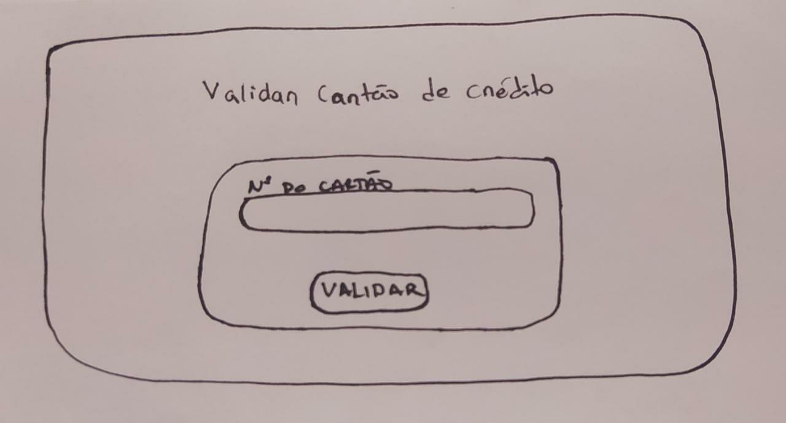
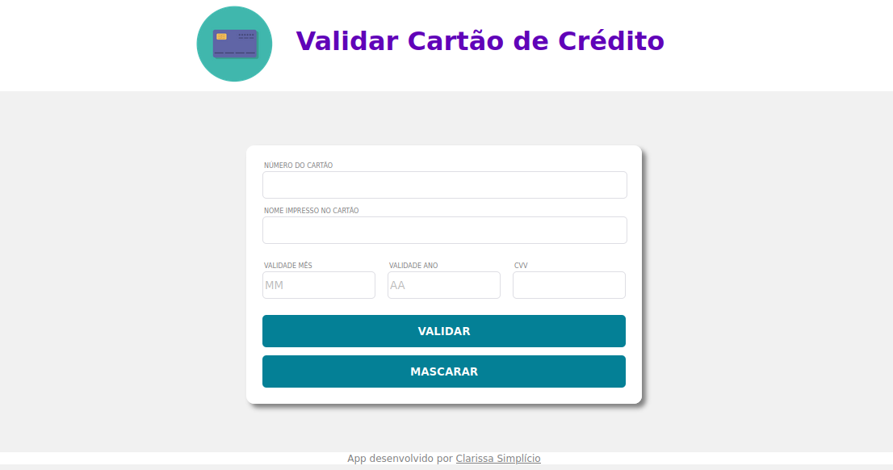

# Aplicativo web para validar Cartões de crédito

## Índice

* [1. Resumo ](#1-Resumo)
* [2. Layout](#2-Layout)
* [3. Objetivos de aprendizagem](#3-objetivos-de-aprendizagem)
* [4. Considerações gerais](#4-consideracoes-gerais)

***
## 1. Resumo

[Aplicativo web](https://clasimplicio.github.io/SAP008-card-validation/) desenvolvido para uso de loja online que utilize pagamento via cartão de crédito. Pensado para priorizar a linguagem direta e simples que o recurso pede, mas sem deixar de lado detalhes ao layout que fazem toda diferença na apresentação.

A validação do cartão de crédito é feita baseada no [algoritmo de Luhn](https://en.wikipedia.org/wiki/Luhn_algorithm), também
chamado de módulo 10.

## 2. Layout

### Protótipo inicial 

A ideia inicial do projeto era de pedir ao usuário apenas os números do cartão,  mas pensando numa melhor utilidade do app, viu-se a necessidade de adicionar campos ao corpo do site com mais informações sobre o cartão a ser validado. Foram adicionados o nome impresso no cartão, a validade e o código de segurança.

### Layout Final 

